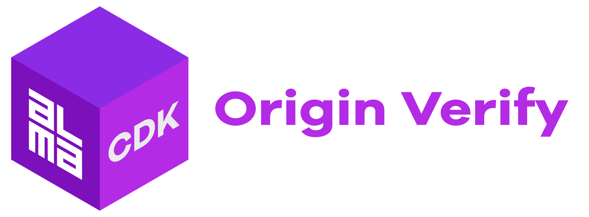
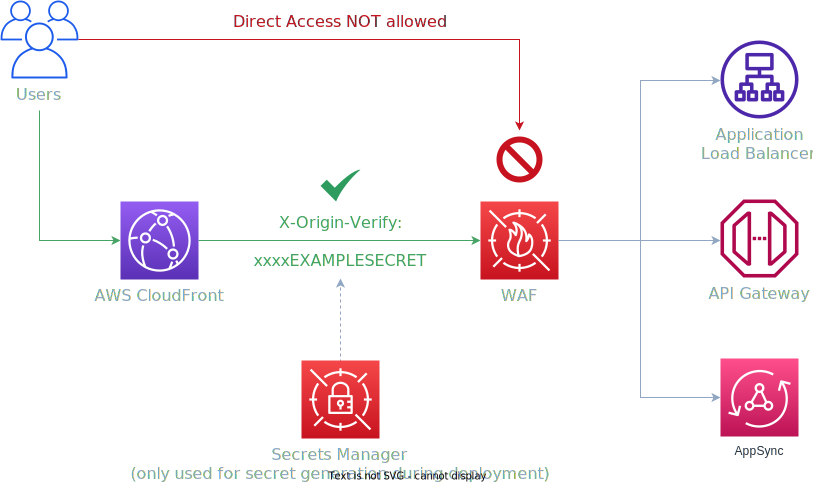

<div align="center">
	<br/>
	<br/>
  <h1>
	
  <br/>
  <br/>
  </h1>

  ```sh
  npm i -D @alma-cdk/origin-verify
  ```

  <div align="left">


  Enforce API Gateway or Application Load Balancer traffic via CloudFront by generating a Secrets Manager secret value which is used as a CloudFront Origin Custom header and a WAFv2 WebACL header match rule.

  </div>
  <br/>
</div>

<br/>



<br/>

Essentially this is an implementation of _AWS Solution_ “[Enhance Amazon CloudFront Origin Security with AWS WAF and AWS Secrets Manager](https://aws.amazon.com/blogs/security/how-to-enhance-amazon-cloudfront-origin-security-with-aws-waf-and-aws-secrets-manager/)” without the secret rotation.

<br/>

## Work in Progress

🚧 &nbsp;**Do not use for production critial stuff! This construct is still very much work in progress and breaking changes may occur.** 🚧

<br/>

## Getting Started

```ts
import { OriginVerify } from '@alma-cdk/origin-verify';
import { Distribution } from 'aws-cdk-lib/aws-cloudfront';
```
```ts
const api: RestApi; // TODO: implement the RestApi
const apiDomain: string; // TODO: implement the domain

const verification = new OriginVerify(this, 'OriginVerify', {
  origin: api.deploymentStage,
});

new Distribution(this, 'CDN', {
  defaultBehavior: { origin: new HttpOrigin(apiDomain, {
    customHeaders: {
      [verification.headerName]: verification.headerValue,
    },
  }) },
})
```

For more detailed example usage see [`/examples`](/examples) directory.

<br/>

## Notes

### Use `OriginProtocolPolicy.HTTPS_ONLY`!

In your CloudFront distribution Origin configuration use `OriginProtocolPolicy.HTTPS_ONLY` to avoid exposing the `verification.headerValue` secret to the world.

### Why `secretValue.unsafeUnwrap()`?

Internally this construct creates the `headerValue` by using AWS Secrets Manager but the secret value is exposed directly by using `secretValue.unsafeUnwrap()` method: This is:
- **required**, because we must be able to set it into the WAFv2 WebACL rule
- **required**, because you must be able to set it into the CloudFront Origin Custom Header
- **okay**, because it's meant to protect the API externally and it's _not_ considered as a secret that should be kept – well – secret within _your_ AWS account

